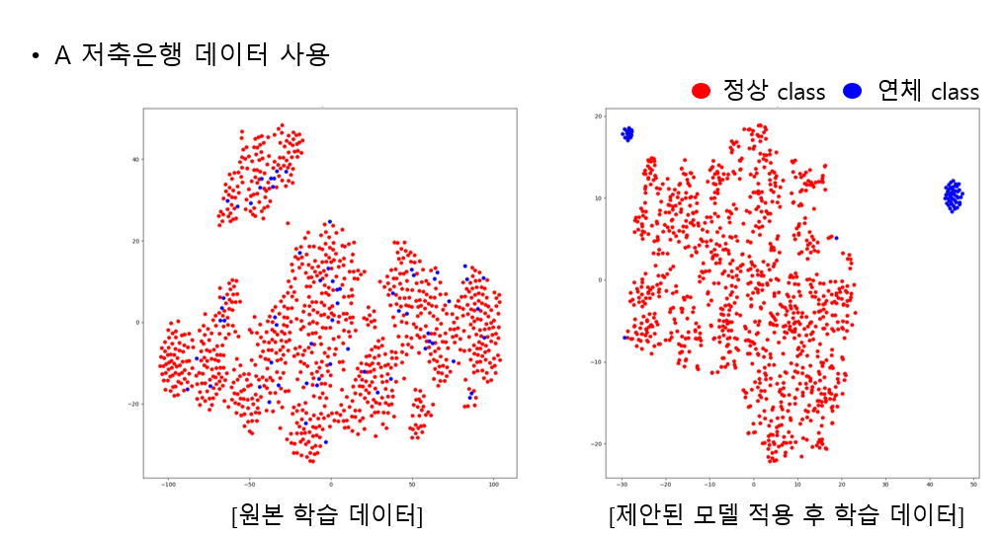
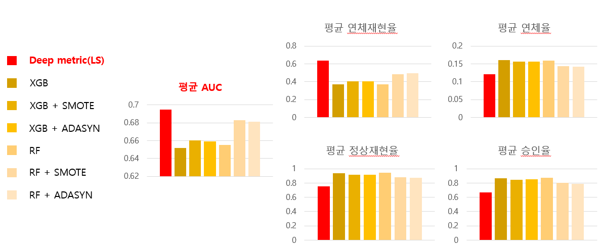

# deep metric을 사용한 개인 신용 예측 모델

## introduction
개인이 신용 대출, 담보 대출 등의 행위로 부채가 생겼을 때 정해진 기간
내에 정상적으로 대출금을 상환할 수 있을지 또는 갚지 못하고 연체될 것인지
를 예측하는 개인 신용 예측 모델을 제안한다. 신용 데이터는 정상적으로 대출
을 상환한 데이터에 비해 연체된 데이터의 비율이 낮은 데이터 불균형 문제가
존재하기 때문에 일반적인 기계학습 모델로는 학습의 어려움이 발생한다. 이러
한 문제를 개선하기 위해 데이터 불균형 문제에 강점이 있는 Deep Metric 모
델을 사용하여 개인 신용 예측 모델을 제안하였다. 또한, Deep Metric 여러 모
델 중 Lifted Structure를 사용한 신용 예측 모델이 기존의 다른 신용 예측 모
델들보다 향상된 성능을 보였다.

## related work
Oh Song, H., Xiang, Y., Jegelka, S., & Savarese, S. (2016).
Deep metric learning via lifted structured feature embedding. In
Proceedings of the IEEE conference on computer vision and pattern
recognition (pp. 4004-4012).
(https://arxiv.org/abs/1511.06452)

Namvar, A., Siami, M., Rabhi, F., & Naderpour, M. (2018).
Credit risk prediction in an imbalanced social lending environment. arXiv
preprint arXiv:1805.00801.
(https://arxiv.org/abs/1805.00801)

## result
A 저축은행 데이터를 Deep Metric 모델을 사용하여 학습하여 변
환된 공간으로 embedding한 결과를 t-sne을 사용해 2차원으로 시각화하였다. 
보여지는 바와 같이 원 데이터 공간에서의 데이터분포는 정상과 연체가 뒤섞여 있어서 분류하기에 적합하지 않으나 Deep Metric으로 변
환된 공간에서의 데이터 분포는 같은 부류의 데이터들은 가깝게 위치하고 다른 부류의 데이터들은 서로 멀리 떨어져 있는 특징을 잘 보여준다.

기존 신용 예측 모델들과 Deep Metric LS를 사용한 실험
결과들의 비교를 보여준다. Deep Metric을 적용한 모델이 기존의 다른 모델보
다 개선된 성능을 보였다. 특히 데이터의 비율이 낮은 연체 부류의 데이터들을
예측하는 성능이 다른 모델보다 높음을 확인하였다. 또한, 각 부류의 데이터들
을 예측하는 성능을 측정하는 AUC 또한 기존 모델들과 비교하였을 때 높은 결
과를 보였다. 그리고 그림 5와 그림 6에서 볼 수 있듯이 제안한 모델을 사용하
였을 때 결과에 대한 AUC 분포가 다른 모델들에 비해 높은 것을 확인하였다.

